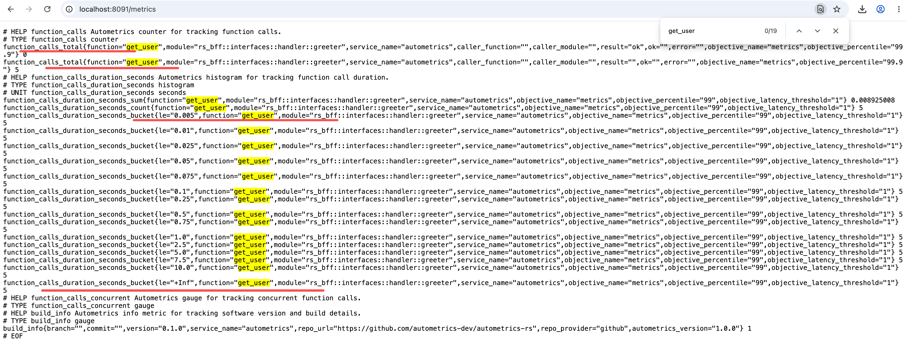

# rs-bff

rs-bff 是一个基于 Rust 的 BFF（Backend for Frontend）应用网关，对外暴露 HTTP API，对内通过 gRPC 调用后端微服务，并完成 JSON 与 Protobuf 之间的协议转换。

## 一、项目架构

项目采用分层架构组织代码：

```
src/
├── main.rs              # 入口：初始化配置、日志、路由、metrics、优雅退出
├── rust_grpc/           # build.rs 自动生成的本地 proto 代码
│   ├── mod.rs
│   ├── user.rs
│   └── order.rs
├── infra/               # 基础设施层
│   ├── mod.rs
│   ├── config/          # 配置系统
│   │   ├── mod.rs
│   │   └── config.rs
│   └── errors/          # 统一错误类型
│       ├── mod.rs
│       └── error.rs
├── interfaces/          # 接口层（HTTP handler + 路由）
│   ├── mod.rs
│   ├── handler/         # HTTP handler 实现
│   │   ├── mod.rs
│   │   └── greeter.rs
│   └── router/          # axum 路由定义
│       ├── mod.rs
│       └── api.rs
└── providers/           # 提供者层（gRPC 客户端等外部服务连接）
    ├── mod.rs
    ├── provider.rs      # AppState 组装
    └── grpc/
        ├── mod.rs
        ├── client.rs    # GrpcClientManager 实现
        └── readme.md
```

### 核心分层职责

- **infra**：配置解析、错误定义等基础能力，被上层依赖。
- **providers**：管理外部连接（gRPC client、数据库等），向上暴露 `AppState`。
- **interfaces**：处理 HTTP 请求，包含路由注册和 handler 实现，依赖 `AppState` 调用底层服务。

## 二、技术栈

| 用途 | 依赖 |
|------|------|
| HTTP Web 框架 | [axum](https://crates.io/crates/axum) 0.8.9 |
| gRPC 客户端/运行时 | [tonic](https://crates.io/crates/tonic) 0.14.6 + tonic-prost 0.14.6 |
| Protobuf 序列化 | [prost](https://crates.io/crates/prost) 0.14.3 |
| 异步运行时 | [tokio](https://crates.io/crates/tokio) 1.52.1 |
| 配置/JSON | serde + serde_json + serde_yaml |
| 日志 | log + env_logger + chrono |
| 错误处理 | [thiserror](https://crates.io/crates/thiserror) 2 |
| 可观测性/Metrics | [autometrics](https://crates.io/crates/autometrics) 3.0.0 + [monitor](https://github.com/rs-god/hera) |
| 优雅退出 | [shutdown](https://github.com/rs-god/hera) |
| 外部 PB 协议托管 | [hello-pb](https://github.com/daheige/hello-pb) |

## 三、配置系统

通过 `app.yaml` 驱动：

```yaml
app_debug: true               # 调试模式（线上设为 false）
app_port: 8080                # HTTP 服务端口
monitor_port: 8091            # Prometheus metrics 端口
log_level: info               # 日志级别
graceful_wait_time: 5         # 优雅退出等待时间（秒）
services:
  - name: greeter-svc
    target: http://127.0.0.1:50051
  - name: user
    target: http://127.0.0.1:50052
```

配置读取禁止默认值：找不到服务时直接报错退出，确保配置缺失能被及时发现。

## 四、Protobuf 协议

### 本地 proto（build.rs 生成）

`build.rs` 自动扫描 `proto/` 目录，通过 `tonic-prost-build` 生成代码到 `src/rust_grpc/`，并自动创建 `mod.rs`：

- 编译前清理旧文件，删除协议后不会残留旧模块
- 自动按文件名排序并生成 `pub mod xxx;`

当前本地 proto：
- `proto/user.proto`
- `proto/order.proto`

### 外部 PB 协议托管（推荐）

对于多服务共享的协议，推荐通过独立仓库 + git 依赖托管，避免各服务重复生成和版本不一致。

本项目已接入 [hello-pb](https://github.com/daheige/hello-pb) 作为外部协议依赖：

```toml
hello-pb = { git = "https://github.com/daheige/hello-pb", tag = "v1.0.5" }
```

## 五、错误处理

统一错误类型 `AppError`：

```rust
pub enum AppError {
    Grpc(tonic::Status),
    GrpcTransport(tonic::transport::Error),
    Serialization(serde_json::Error),
    Internal(String),
}
```

已实现 `axum::response::IntoResponse`，自动映射 HTTP 状态码：

| gRPC Code | HTTP Status |
|-----------|-------------|
| NotFound | 404 |
| InvalidArgument | 400 |
| Unauthenticated | 401 |
| PermissionDenied | 403 |
| AlreadyExists | 409 |
| Unavailable | 503 |
| DeadlineExceeded | 504 |
| 其他 | 500 |

## 六、HTTP API

当前暴露的路由：

```
GET  /                  -> hello,bff
GET  /api/v1/greeter/say/{name}  -> 调用 greeter gRPC 服务
```

未匹配路由会返回统一的 JSON 错误：

```json
{
  "code": 404,
  "message": "api not found",
  "data": {}
}
```

## 七、可观测性

基于 `autometrics` + `monitor` 自动暴露 Prometheus 指标：

- 访问地址：`http://localhost:8091/metrics`
- 每个 HTTP handler 通过 `#[autometrics(objective = API_SLO)]` 自动采集请求延迟、成功率等指标

效果预览：



## 八、运行方式

```bash
# 开发运行
cargo run

# 确保 app.yaml 中配置的 gRPC 后端服务已启动
```

服务默认监听 `0.0.0.0:8080`，metrics 监听 `8091`。

## 九、关键演进记录

1. **架构分层**：从扁平结构演进为 `infra / providers / interfaces` 分层，职责更清晰。
2. **PB 协议托管**：从本地 `build.rs` 生成所有协议，演进为本地 proto + 外部 `hello-pb` git 依赖混合模式。
3. **可观测性**：引入 `autometrics` 自动埋点 + Prometheus exporter，替代手动指标采集。
4. **优雅退出**：引入 `shutdown` 组件，支持 `SIGTERM/SIGINT` 信号平滑关闭 HTTP 和 metrics 服务。
5. **日志系统**：从 `tracing` 演进为 `log + env_logger + chrono`，当前场景更轻量（`trace.md` 保留了 tracing 用法参考）。
6. **配置系统**：从硬编码环境变量演进为 YAML 配置驱动，禁止默认值，缺失即报错。

## 组件库

- [axum](https://crates.io/crates/axum)
- [rs-api](https://github.com/daheige/rs-api)
- [hello-pb](https://github.com/daheige/hello-pb)
- [hera (monitor/shutdown)](https://github.com/rs-god/hera)
